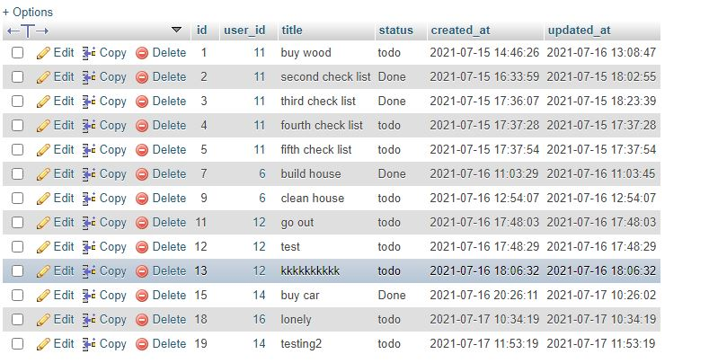

<p align="center"><a href="https://laravel.com" target="_blank"></a></p>

# Task management system (Storex Web)
### The required steps to setup the project:
* install Laravel
 ```
composer global require laravel/installer
 ```
* download code or clone it
```
 git clone https://github.com/MhdTa/API-for-product-site-Damazlle.git
```
* set database parameter in .env file
* run migrations
 ```php
 php artisan migrate
 ```
 * run the app
 ```
 php artisan serve
 ```
# The Structure
We have 5 Controllers:
  * Login Controller
  * Register Controller
  * Logout Controller
  * CheckList Controller
  * Task Controller.
and 3 Models:
 * CheckList Model 
 * Task Model (many to one with CheckList) checkList can have multi Tasks but Task have one checkList
 * User Mode
 ## Web route file:
  ```php
  //log out Route
Route::post('/logout', [LogoutController::class, 'store'])->name('logout');
//log in Route
Route::get('/login', [LoginController::class, 'index'])->name('login');
Route::post('/login', [LoginController::class, 'store']);
//sign in Route
Route::get('/register', [RegisterController::class, 'index'])->name('register');
Route::post('/register', [RegisterController::class, 'store']);
//checkList Route
Route::get('/', [CheckListController::class, 'home'])->name('home');
Route::get('/checkList', [CheckListController::class, 'index'])->name('checkList');
Route::post('/checkList', [CheckListController::class, 'store'])->name('checkList.add');
Route::get('/checkList/{id}', [CheckListController::class, 'done'])->name('checkList.done');
Route::get('/checkList/edit/{id}', [CheckListController::class, 'editView'])->name('checkList.edit');
Route::post('/checkList/edit/{id}', [CheckListController::class, 'edit'])->name('checkList.edit');
Route::delete('/checkList/delete/{id}', [CheckListController::class, 'destroy'])->name('checkList.destroy');

//tasks Route
Route::post('/task/{checkListId}', [TaskController::class, 'store'])->name('task.add');
Route::get('/task/{id}', [TaskController::class, 'done'])->name('task.done');
Route::get('/task/edit/{id}', [TaskController::class, 'editView'])->name('task.edit');
Route::post('/task/edit/{id}', [TaskController::class, 'edit'])->name('task.edit');
Route::delete('/task/delete/{id}', [TaskController::class, 'destroy'])->name('task.destroy');
  ```
 
 ## Signin
After entering the required information, it will be verified and authenticated
 ```php
    public function store(Request $request)
    {
        $this->validate($request, [
           
            'username' => 'required|max:255',
            'tel' => 'required|max:255',
            'password' => 'required|confirmed',
        ]);

        User::create([
            'username' => $request->username,
            'tel' => $request->tel,
            'password' => Hash::make($request->password),
        ]);

        auth()->attempt($request->only('tel', 'password'));

        return redirect()->route('home');
    }
    
  ```
   
## Log in
You can also login by entering phone number and password
 ```php
 public function store(Request $request)
    {
        //validate the data
        $this->validate($request, [
            'tel' => 'required',
            'password' => 'required',
        ]);

        
        if (!auth()->attempt($request->only('tel', 'password'), $request->remember)) {
            return back()->with('status', 'Invalid login details');
        }

        return redirect()->route('home');
    }
 ```
 
## Check List page
after login you can show your check list
 ```php
    public function home(Request $request)
    {
        //get check list of user
        $checkLists = CheckList::get()->where('user_id', auth()->user()->id);
        //get count of done check lists
        $checkListDoneCount = $checkLists->where('status','Done')->count();
        //if user choice filter the data
        if ($request->input('sort') && $request->input('sort') != 'Oldest') 
           $this->sortMyTasks($request->input('sort'), $checkLists);

        return view('home', [
            'checkLists' => $checkLists,
            'checkListDoneCount' => $checkListDoneCount
        ]);
    }
  ```
  
  and you can:
  * Edit your check list
  * Delete your check list
  * Make your check list Done
  * if you make check list done : all her tasks will be done
  * 
  
  
## Tasks
* you can add task to any check list or edit it or delete it or make it Done
* you can filter your Tasks:
  * Sort by Latest Tasks
  * Sort by Oldest Tasks
  * Sort by todo Tasks
  * Sort by Done Tasks
  * Hide Done Tasks
  
   
   
 ## Example of latest tasks sort:
  
  
 ## Example of hidden done tasks :
  
  

 ## Notes:
 * If you are not logged-in you can not add checkList
  ```php
     public function __construct()
    {
        //just loged in user can do these functions
        $this->middleware(['auth']);
    }
   ```
 ## DataBase:
 * Users Table:
   
 * CheckLists Table:
    
 * Tasks Table:
    
   
   Hope you liked it ..... Mohamed Taha
    
     
